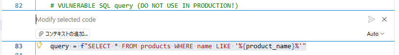

# 演習 3: GitHub Copilotによるセキュリティ修正

| [← 前の手順](./2-vulnerability-demo.md) | [次の手順: 修正版の動作確認と総括 →](./4-verification.md) |
|:--|--:|

このセクションでは、GitHub Copilot Chatのインライン機能を活用して、SQL Injection脆弱性を効率的に修正します。AIアシスタントとの協働により、セキュアなコードへと改修します。

## シナリオ

前の演習でSQL Injection攻撃の深刻な影響を確認しました。今度はGitHub Copilotを活用して、この脆弱性を効率的に修正します。

この演習では以下を達成します：
- 脆弱なコードの特定と問題点の理解
- GitHub Copilot インライン機能を使った修正プロンプトの作成
- プリペアードステートメントへの安全なコード変換

修正完了後は、次の演習で修正効果を検証し、攻撃が防げることを確認します。

## 必須 1. 脆弱なコードの特定と分析

### 1.1 脆弱性ファイルを開く

VS CodeでPython版の脆弱性ファイルを開きます：`demos/sqlinject_python.py`

### 1.2 問題箇所の確認

脆弱なSQLクエリ構築部分を見つけます：

**Python版**の問題箇所：
```python
query = f"SELECT * FROM products WHERE name LIKE '%{product_name}%'"
```

**なぜ脆弱か:**
- ユーザー入力が直接SQLクエリに埋め込まれている
- SQLインジェクション攻撃により任意のSQL文が実行可能
- データベース全体への不正アクセスが可能

## 必須 2. GitHub Copilotインライン修正の実行

### 2.1 脆弱なコード行の選択

脆弱なクエリ行を選択します。

### 2.2 インラインChatを起動

**`Ctrl + I`** でインラインChatを開き、Copilotのインライン修正画面が表示されることを確認します。



### 2.3 修正プロンプトの入力

インラインChatに以下のプロンプトを入力します：

```
このSQL Injectionの脆弱性を修正してください。
プリペアードステートメントを使用し、安全なクエリに書き換えてください。
```

**プロンプトのポイント:**
- 具体的な修正方法（プリペアードステートメント）を指定
- セキュリティ脆弱性であることを明示
- 簡潔で分かりやすい指示

### 2.4 Copilotによる修正提案の確認

Copilotが以下のような修正コードを提案することを確認します：

**Python版の期待される修正:**
```python
query = "SELECT * FROM products WHERE name LIKE ?"
cursor.execute(query, (f'%{product_name}%',))
```

## 必須 3. 修正の適用と保存

### 3.1 修正コードの詳細確認

1. Copilotが提案した修正コードの詳細を確認します
2. 以下の点が修正されていることを確認：
   - **プレースホルダーの使用**: `?` または名前付きプレースホルダー
   - **パラメータの分離**: SQLクエリと値が分離されている
   - **適切なAPIの使用**: プリペアードステートメント用のメソッド

### 3.2 修正の適用

提案された修正が適切であることを確認したら、チェックマークボタンをクリックして修正を適用します。


### 3.3 ファイルの保存

ファイルを保存し、変更が保存されたことを確認します。

## 参考 4. 修正内容の理解

### 4.1 プリペアードステートメントの仕組み

**修正前（脆弱）:**
```python
query = f"SELECT * FROM products WHERE name LIKE '%{product_name}%'"
# ユーザー入力が直接クエリに埋め込まれる
```

**修正後（安全）:**
```python
query = "SELECT * FROM products WHERE name LIKE ?"
cursor.execute(query, (f'%{product_name}%',))
# クエリとパラメータが分離され、DBエンジンが安全に処理
```

### 4.2 セキュリティ強化のポイント

1. **クエリとデータの分離**: SQLクエリとユーザーデータを完全に分離
2. **エスケープ処理**: データベースエンジンが自動的に危険な文字をエスケープ
3. **SQL構文の保護**: クエリ構造の改変が不可能

## オプション 5. 追加のセキュリティ改善

### 5.1 入力値検証の追加

Copilotに以下のプロンプトでさらなる改善を依頼することもできます：

```
入力値のバリデーション処理も追加してください。
空文字列や無効な入力をチェックする仕組みを含めてください。
```

### 5.2 エラーハンドリングの強化

```
データベースエラーの適切なハンドリングと
セキュリティを考慮したエラーメッセージ表示を追加してください。
```

## トラブルシューティング

### 問題が発生した場合

1. **Copilotが期待通りの修正を提案しない場合**:
   - プロンプトをより具体的に記述し直す
   - 「プリペアードステートメント」「SQLインジェクション対策」などのキーワードを含める

2. **修正適用後にエラーが発生する場合**:
   - 適用された修正内容を再確認
   - 必要に応じて手動で微調整を行う

3. **インラインChatが起動しない場合**:
   - GitHub Copilot Chat拡張機能が有効になっているか確認
   - VS Codeを再起動してみる

## まとめと次のステップ

GitHub Copilotを活用して、SQL Injection脆弱性をプリペアードステートメントを使用した安全なコードに修正できました。次は修正版のアプリケーションを起動し、攻撃が防げることを確認してみましょう。

**完了したこと：**
- ? 脆弱なコードの特定
- ? GitHub Copilotによる修正提案の取得
- ? プリペアードステートメントへの修正適用
- ? セキュアなコードへの変更

## リソース

- [Prepared Statements - OWASP](https://cheatsheetseries.owasp.org/cheatsheets/Query_Parameterization_Cheat_Sheet.html)
- [GitHub Copilot公式ドキュメント](https://docs.github.com/en/copilot)
- [SQL Injection Prevention](https://owasp.org/www-project-sql-injection-prevention-cheat-sheet/)

---

| [← 前の手順](./2-vulnerability-demo.md) | [次の手順: 修正版の動作確認と総括 →](./4-verification.md) |
|:--|--:|