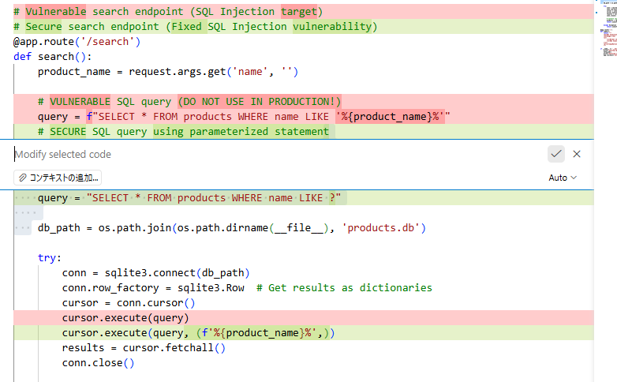

# GitHub Copilot活用 - 実践セキュリティ修正ハンズオン

## ? 目的
このハンズオンでは、**実際に動作するセキュリティ脆弱性のあるアプリケーション**を使って、GitHub Copilotを活用したセキュリティ修正を体験します。

## ? 概要
1. **脆弱性を含んだSQLアプリケーションの立ち上げ**: Node.jsまたはPython版の脆弱なWebアプリケーションを起動し、SQL Injection攻撃を実際に成功させて、セキュリティ脆弱性の危険性を体験します。
2. **Copilotを用いた修正**: GitHub Copilot Chatを活用して、脆弱なコードをプリペアードステートメントを使った安全なコードに修正し、攻撃を無効化します。


## 手順書

### **1. 脆弱性を含んだSQLアプリケーションの立ち上げ**

#### **1-0. 事前準備（ソースコードのクローン）**

  **1-0-1. リポジトリのクローン**
  - PowerShellまたはコマンドプロンプトを開きます
  - 作業用フォルダーに移動します（例：`cd C:\workspace`）
  - 以下のコマンドでリポジトリをクローンします
    ```powershell
    git clone <このリポジトリのURL>
    ```
  - **注意**: `<このリポジトリのURL>` は講師から提供されたGitHubリポジトリのURLに置き換えてください

**1-0-2. VS Codeでプロジェクトを開く**
- VS Codeを起動します
- File > Open Folder からクローンしたプロジェクトフォルダー全体を選択して開きます  


#### **1-1. SQLアプリケーションの立ち上げ**
・[方法A：Nodeを用いた立ち上げ](#1-2-方法anode-js版の立ち上げ)  
・[方法B：Pythonを用いた立ち上げ](#1-3-方法bpython版の立ち上げ)  

#### **1-2. 方法A：Node.js版の立ち上げ**

**1-2-1. Node.jsのインストール確認**
- PowerShellまたはコマンドプロンプトを開きます
- `node --version` コマンドでNode.jsがインストールされているか確認します
- インストールされていない場合は [nodejs.org](https://nodejs.org/) からLTS版をダウンロード・インストールします

**1-2-2. demosフォルダーに移動**
- VS Code内でターミナルを開きます（Ctrl + `）
- 以下のコマンドでdemosフォルダーに移動します
  ```powershell
  cd demos
  ```

**1-2-3. 必要なパッケージのインストール**
- package.jsonに記載された依存関係をインストールします
  ```powershell
  npm install express sqlite3
  ```

**1-2-4. Node.js版アプリケーションの起動**
- sqlinject.jsファイルを実行します
  ```powershell
  node sqlinject.js
  ```
- 「Server running on http://localhost:8080」のメッセージが表示されることを確認します

#### **1-3. 方法B：Python版の立ち上げ**

**1-3-1. Pythonのインストール確認**
- PowerShellまたはコマンドプロンプトを開きます
- `python --version` コマンドでPythonがインストールされているか確認します
- インストールされていない場合は Microsoft Store から Python をインストールします

**1-3-2. demosフォルダーに移動**
- VS Code内でターミナルを開きます（Ctrl + `）
- 以下のコマンドでdemosフォルダーに移動します
  ```powershell
  cd demos
  ```

**1-3-3. 必要なライブラリのインストール**
- Flaskライブラリをインストールします
  ```powershell
  pip install flask
  ```

**1-3-4. Python版アプリケーションの起動**
- sqlinject_python.pyファイルを実行します
  ```powershell
  python sqlinject_python.py
  ```
- 「 * Running on http://127.0.0.1:8080」のメッセージが表示されることを確認します

#### **1-4. 脆弱性の動作確認**

**1-4-1. 正常な検索機能の確認**
- ブラウザを開き、`http://localhost:8080/search?name=Apple` にアクセスします
- Appleを含む製品が表示されることを確認します

**1-4-2. SQL Injection攻撃の実行**
- ブラウザで `http://localhost:8080/search?name=' OR 1=1 --` にアクセスします
- **注意**: 本?1件の結果が期待されるところ、すべての製品（41件）が表示されることを確認します
- これがSQL Injection脆弱性による情報漏洩の実演です

### **2. Copilotを用いた修正**

#### **2-1. 脆弱性ファイルを開く**

**2-1-1. 対象ファイルの特定**
- VS Codeのエクスプローラーでdemosフォルダーを展開します

**2-1-2. 脆弱性ファイルを開く**
- Node.js版の場合：`demos/sqlinject.js` を開きます
- Python版の場合：`demos/sqlinject_python.py` を開きます  

#### **2-2. 脆弱なコードの特定**

**2-2-1. 問題箇所の確認**
- **JavaScript版**の場合、以下の行を確認します：
  ```javascript
  let query = `SELECT * FROM products WHERE name LIKE '%${productName}%'`;
  ```
- **Python版**の場合、以下の行を確認します：
  ```python
  query = f"SELECT * FROM products WHERE name LIKE '%{product_name}%'"
  ```

#### **2-3. 脆弱なコード行の選択と修正依頼**

  **2-3-1. コード選択**
  - 上記で確認した脆弱なクエリ行をマウスで選択します

  **2-3-2. インラインChatで修正プロンプト入力**
  - **Ctrl + I** を押してインラインChatを開きます
  
  - 以下のプロンプトを入力します：
    ```
    このSQL Injectionの脆弱性を修正してください。
    プリペアードステートメントを使用し、安全なクエリに書き換えてください。
    ```

#### **2-4. 修正コードの確認と適用**  
  **2-4-1. 生成されたコードの確認**
  - Copilotが生成した修正コードを確認します
  - **JavaScript版**期待される修正例：
    ```javascript
    const query = `SELECT * FROM products WHERE name LIKE ?`;
    db.all(query, [`%${productName}%`], (err, rows) => {
      // エラーハンドリングと結果処理
    });
    ```
  - **Python版**期待される修正例：
    ```python
    query = "SELECT * FROM products WHERE name LIKE ?"
    cursor.execute(query, (f'%{product_name}%',))
    ```

  **2-4-2. 修正コードの適用**
  - 「?」ボタンをクリックして修正を適用します
  
  - ファイルを保存します（Ctrl + S）

#### **2-5. 修正版の動作確認**  
  **2-5-1. 修正版アプリの起動**
  - ターミナルで前回実行したアプリを停止します（Ctrl + C）
  - 修正版を再起動します：
    ```powershell
    node sqlinject.js    # Node.js版の場合
    python sqlinject_python.py    # Python版の場合
    ```

  **2-5-2. セキュリティ修正の確認**
  - ブラウザで再度攻撃を試します：`http://localhost:8080/search?name=' OR 1=1 --`
  - **期待される結果**: 検索結果なし、またはエラーメッセージが表示される
  - 正常な検索が機能することを確認：`http://localhost:8080/search?name=Apple`

  **2-5-3. 修正完了の確認**
  - SQL Injection攻撃が無効化されていることを確認します
  - 正常な検索機能は維持されていることを確認します


## Hands-Onのゴール

このHands-onデモを完了し、以下のスキルの体感をしていただきました。

- **セキュリティ脆弱性の実体験**: SQL Injection攻撃を実際に成功させ、脆弱性の危険性とインパクトを理解
- **GitHub Copilot インラインChatの活用**: 適切なプロンプトで脆弱なコードを安全なコードに修正してもらう

